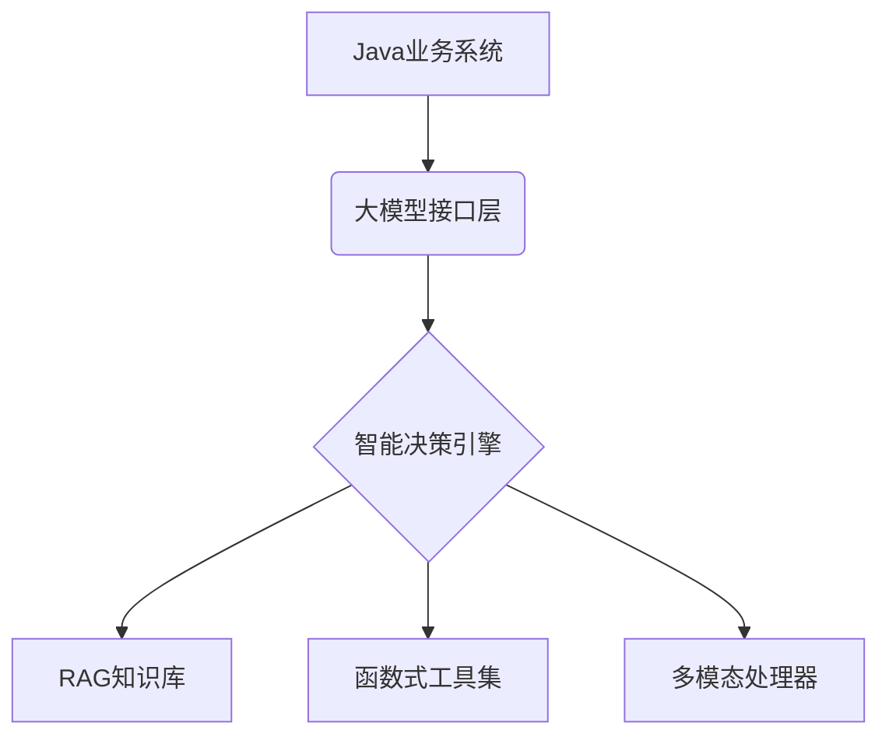

## 🚀 开启你的AI开发革命

**Java开发者正在面临技术变革窗口！** 当95%的AI教程还在聚焦Python时，我们为百万Java工程师打开通向AGI时代的大门：

- 💡 无需AI基础，48小时快速构建企业级RAG知识引擎
- ⚡ 深入Spring生态，打造可落地的智能业务中台
- 🔥 掌握LangChain4J核心架构，对接15+主流大模型
- 🎯 破解复杂业务场景：从多模态处理到函数式编排
- 🆓 完全免费的顶级AI开发课程

<Note>这个课程彻底改变了我们团队的技术栈！—— 某金融科技公司CTO</Note>

## 课程核心价值

### 🌟 您将掌握
- 企业级AI应用架构设计方法论
- 全自动RAG知识引擎开发

### 🏆 课程特色
<CardGroup cols={1}>
  <Card>
    ✅ 30+真实业务场景案例库  
    ✅ 配套企业级开发脚手架  
    ✅ 永久更新的课程知识库  
    ✅ 完全免费的学习资源
  </Card>
</CardGroup>

## 课程技术栈全景

### 🛠 核心框架
- **LangChain4J**：企业级AI应用标准解决方案
- **Spring AI**：Spring官方AI扩展框架 （TODO）
- **DeepSeek4J**：国产大模型最佳实践

### 🔥 热门技术

## 💼 职业跃迁之路

**学完本课程您将具备：**
- 智能系统架构设计能力
- 企业级AI中台建设经验
- 复杂业务场景解决方案
- 主流大模型调优经验

<Tip>据智联招聘数据，掌握AI开发的Java工程师薪资溢价达56%</Tip>

<Card title="文档有误？请协助编辑" icon="pencil" href="https://github.com/javaai-pig4cloud-com/javaai-docs/edit/main/introduction.mdx">
  发现文档问题？点击此处直接在 GitHub 上编辑并提交 PR，帮助我们改进文档！
</Card>